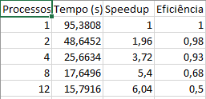

# atv3-rafael

Relatório da Atividade 3 - Paralelização de Avaliador de Logs

Disciplina: Programação Concorrente
Aluno(s): [Pedro Henrique Ayres de Sousa]
Turma: [SI- Noturno]
Professor: [Rafael]
Data: [25/03/2025]

. Descrição do Problema

O problema consiste no processamento de grandes volumes de arquivos de log contendo informações operacionais. Cada arquivo deve ser analisado para extrair métricas como número de linhas, palavras, caracteres e ocorrência de palavras-chave específicas ("erro", "warning" e "info").

O programa tem como objetivo realizar esse processamento de forma eficiente, comparando uma versão sequencial (serial) com uma versão paralela.

O algoritmo utilizado percorre todos os arquivos da pasta, lendo linha por linha e contabilizando os dados relevantes. A paralelização foi implementada utilizando múltiplos processos, distribuindo os arquivos entre eles.

O volume de dados utilizado nos testes foi de:

1000 arquivos
10.000.000 linhas
200.000.000 palavras

A complexidade aproximada do algoritmo é O(n), onde n representa o total de linhas processadas.

O objetivo da paralelização é reduzir o tempo total de execução através do uso de múltiplos núcleos de processamento.

2. Ambiente Experimental
Item	Descrição
Processador	[12th Gen Intel(R) Core(TM) i7-12700   2.10 GHz]
Número de núcleos	[12]
Memória RAM	[16GB]
Sistema Operacional	[Windows 11 Pro]
Linguagem utilizada	Python
Biblioteca de paralelização	multiprocessing (Pool)
Compilador / Versão	Python 3.x

3. Metodologia de Testes

O tempo de execução foi medido utilizando a função time.time() da linguagem Python.

Foi realizada uma execução para cada configuração de número de processos, considerando que os dados são determinísticos.

O tamanho da entrada foi fixo:

1000 arquivos (log2)

As configurações testadas foram:

1 processo (serial)
2 processos
4 processos
8 processos
12 processos

Os testes foram executados em ambiente local, sem controle de carga da máquina.

4. Resultados Experimentais
Nº Processos	Tempo de Execução (s)
1	95.3808
2	48.6452
4	25.6634
8	17.6496
12	15.7916

5. Cálculo de Speedup e Eficiência
Speedup

Speedup(p) = T(1) / T(p)

Eficiência

Eficiência(p) = Speedup(p) / p

6. Tabela de Resultados

7. Gráfico de Tempo de Execução

